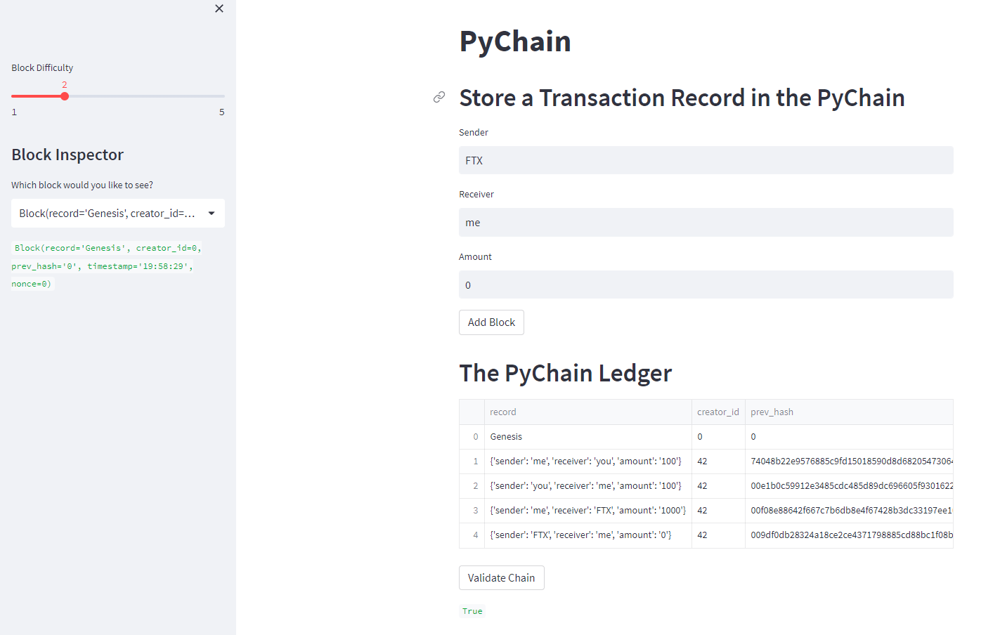

# Challenge 18 PyChain Ledger

## Introduction
Build a blockchain ledger using Pychain, Streamlit, and Hashlib.

## Summary
The application creates a verifiable blockchain that the user can update on a web browser.  The drop down menu allows the user to inspect previous blocks. 

